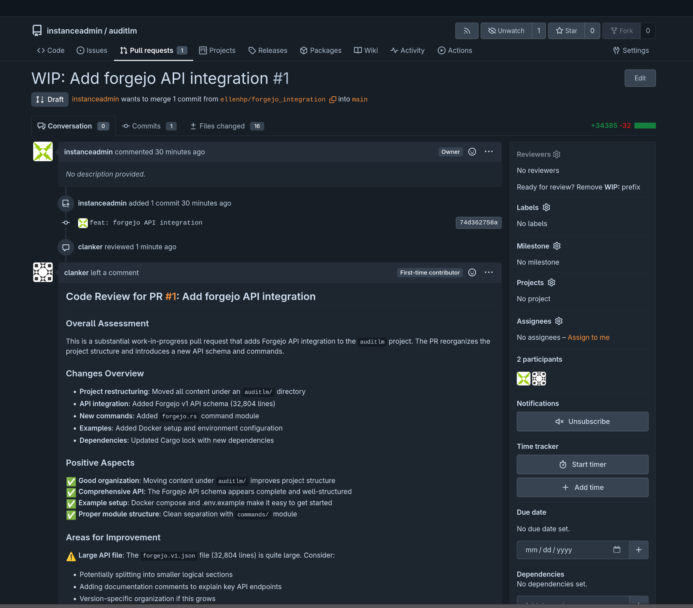

# auditlm

This is a dead-simple self-hostable code review bot with forgejo integration. Sometimes you don't have a human to review your change for whatever reason, and sometimes you don't want to give Microsoft more training data for Copilot.

See [examples/README.md](examples/README.md) for a quickstart.

